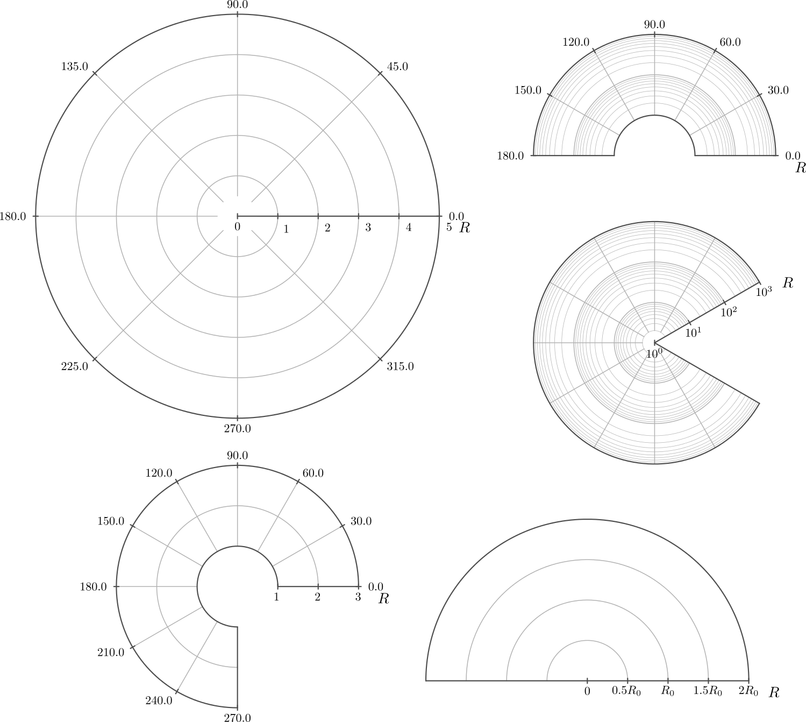
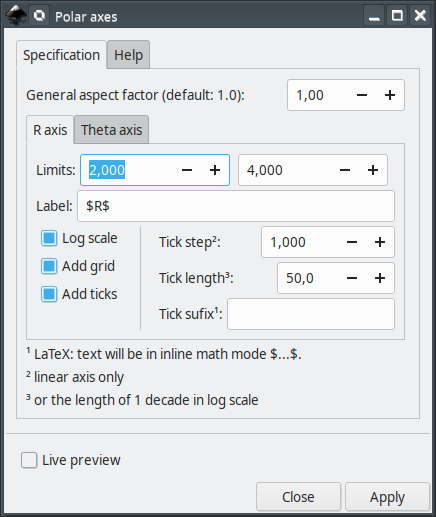
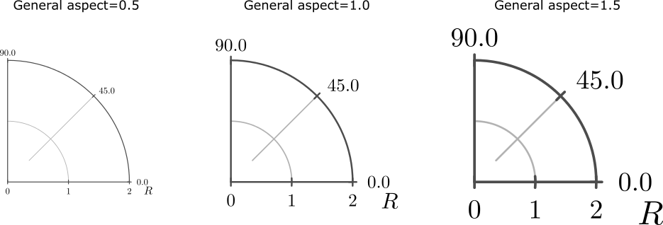
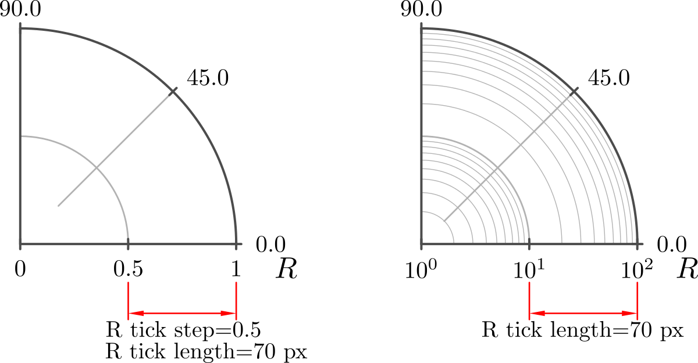
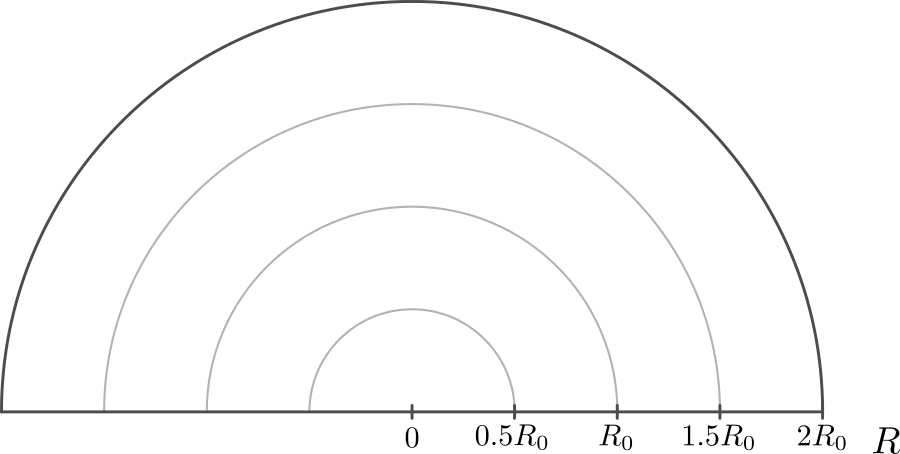

# polarAxes2D
This extension will assist you creating Polar axes in [Inkscape](https://inkscape.org/).




### main features

The main features are

 - Linear and log10 scales for R axis
 - Optional grid lines in R and Theta directions
 - Adjustable tick mark intervals and sizes
 - Optional LaTeX support

## Current and older versions

Compatibility table

|  Inkscape        |  polarAxes2D | inkscapeMadeEasy | Receive updates?|
|------------------|-----------------|------------------|-----------------|
|       1.0        | 1.0 (latest)    |   1.0 (latest)   | YES             |
| 0.48, 0.91, 0.92 | 0.9x (obsolete) |  0.9x (obsolete) | NO              |


**Latest version:** The latest version of **polarAxes2D** is **1.0**. This version is compatible with Inkscape 1.0 and up only. It is **incompatible** with older Inkscape versions!

**Older versions:** If you have an older version of Inkscape, please use the files under the folder **0.9x** on Github.

**Important: Only the latest version will receive updates, new features, and bug fixes! The usage section in this documentation describes the latest version. In older versions, the disposition of the elements in the plugin's screen might be different. Some features might not be present or have different behavior.**

# Installation and requirements

Installation procedures for latest and older versions are described below.

## Requirements (all versions)

- You will need [inkscapeMadeEasy](https://github.com/fsmMLK/inkscapeMadeEasy) plugin installed. Check the compatibility table above to know the version you need.

## Installation procedure (v1.0 only)

**polarAxes2D** was developed using Inkscape 1.0 in Linux (Kubuntu 18.04). It should work in different OSs too as long as all requirements are met.

1. Install [inkscapeMadeEasy](https://github.com/fsmMLK/inkscapeMadeEasy), **version 1.0** (latest). Follow the instructions in the manual page. **Note:** LaTeX text is used in **polarAxes2D** if the support is activated (nicer results), otherwise regular text elements will be used.

2. **polarAxes2D** installation

    1. Go to Inkscape's extension directory with a file browser. Your inkscape extension directory can be accessed by opening Inkscape and selecting ``Edit > Preferences > System``. Look for the item **User Extensions**  field. There is a button on the right of the field  that will open a file explorer window in that specific folder.

    2. Create a subfolder in the extension directory with the name ``polarAxes2D``. **Important:**  Be careful with upper and lower case letters. You must write as presented above.

    3. Download **polarAxes2D** files and place them inside the directory you just created.

       You don't have to copy all files from Github. The files you will need are inside the ``latest`` folder. In the end you must have the following files and directories in your Inkscape extension directory.

       **LaTeX users:** You can add macros to ``inkscapeMadeEasy/basicLatexPackages.tex``. In this case the same macros will be accessible by all plugins that employ inkscapeMadeEasy.

```
        inkscape
         ┣━━extensions
         ┋   ┣━━ inkscapeMadeEasy      <-- inkscapeMadeEasy folder
             ┃    ┣━━ inkscapeMadeEasy_Base.py
             ┃    ┣━━ inkscapeMadeEasy_Draw.py
             ┃    ┣━━ inkscapeMadeEasy_Plot.py
             ┃    ┗━━ basicLatexPackages.tex
             ┃
             ┣━━ textext               <-- texText folder (if you installed textText)
             ┃    ┋
             ┃
             ┣━━ polarAxes2D        <-- polarAxes2D folder
             ┋    ┣━━ polarAxes2D.inx
                  ┗━━ polarAxes2D.py
        
        NOTE: You might have other sub folders inside the extensions directory. They don't interfere with the plugin.
```

## Installation procedure (v0.9x only)

**polarAxes2D** was developed using Inkscape 0.48 and 0.91 in Linux (Kubuntu 18.04). It should work in different OSs too as long as all requirements are met.

1. Install [inkscapeMadeEasy](https://github.com/fsmMLK/inkscapeMadeEasy), **version 1.0** (latest). Follow the instructions in the manual page. **Note:** LaTeX text is used in **polarAxes2D** if the support is activated (nicer results), otherwise regular text elements will be used.

2. **polarAxes2D** installation

    1. Go to Inkscape's extension directory with a file browser.

    2. Download **polarAxes2D** files and place them inside the directory you just created.

       You don't have to copy all files from Github. The files you will need are inside the ``0.9x`` folder. In the end you must have the following files and directories in your Inkscape extension directory.

        ```
        inkscape
         ┣━━ extensions
         ┋    ┣━━ inkscapeMadeEasy_Base.py
              ┣━━ inkscapeMadeEasy_Draw.py
              ┣━━ inkscapeMadeEasy_Plot.py
              ┃
              ┣━━ textextLib
              ┃    ┣━━ __init__.py
              ┃    ┣━━ basicLatexPackages.tex
              ┃    ┣━━ textext.inx
              ┃    ┗━━ textext.py
              ┃
              ┣━━ polarAxes2D.inx        <--   from repository folder 0.9x!
              ┗━━ polarAxes2D.py         <--
        ```

# Usage

The extension can be found under `extensions > fsmMLK > Plot 2D > Polar` menu.

This extension is presented in one tab, **Specification**.



**General aspect factor:** General aspect ratio between line widths and text height. I designed this extension to have an overall aspect ratio that "looks nice". It is a function of R tick length. With this control you can scale both line width and text height. The defauls value is 1.0.




### R and Theta axes subtab

This tab has two pages, one for each axis. They affect the axes the same way, with a few exceptions, presented below.

**Limits:** Set the range of values. On the side there are two fields for the lower and upper limits.

The extension will inform if these limits are invalid.

  - The upper limit must be greater than the lower limit
  - If logarithmic scale is checked (R axis only), then the limits must be greater than 1.0
  - If logarithmic scale is checked (R axis only), then the lower limit will be rounded down to the nearest power of 10 and the upper rounded up to the nearest power of 10 in order to complete the decades. Ex: 1.2 to 12, then the limits will be rounded to 1 to 100
  - In theta direction, the values must be in degrees.

**Label (R axis only):** label of the axes. If LaTeX support is activated and you want to write in mathematical environment, enclose your text with $...$.

> Tip: Since `siunitx` package is included in inkscapeMadeEasy's basicLatexPackages.tex, you can use any unit command available there too!

> Ex: `Foobar $\sqrt{x^2}$ so fancy! (\si{\newton\per\squaremetre})`


**Log scale (R axis only):** Set the axis to be represented in log10 scale. In such case, the limits of the axis must be both greater than zero.

**Add grid:** Draw grid lines.

   - *linear scale:* The grid lines will be placed at the tick marks.
   - *log scale (R axis only):* The grid lines will be placed dividing each decade in 10 parts

**Add ticks:** Draw tick marks with associated values. 

**Tick step:** Tick mark interval, in units of your chart. This option does not affect log scale. In theta direction, the values must be in degrees.

Ex: limits from 0 to 2, with tick step of 0.5 will produce ticks at 0, 0.5, 1, 1.5, 2

> Note: The ticks will radiate from the origin R=0 or Theta=0 unless the origin does not lie within the limits. In such cases, the ticks will radiate  from the lower limit.
>
> Examples
>
> 

**Tick length (R axis only)** The distance between tick marks, in units of your canvas. See image below.



**Tick suffix (R axis only):** Optional extra suffix to be added to tick text. **LaTeX support enabled**: You can use any LaTeX text/commands valid in mathematical environment. You don't have to enclose your text between $...$.

**Atention**: the values appended to tick mark text will NOT affect input/output limits!




# Observations
 - The Radius must be positive
 - The limits of Theta are bounded between 0 and 360 degrees
 - Angle indication is in degrees.
 - The axes will be created in the center of your screen.

# To do

 - Add option to allow theta in radians.


